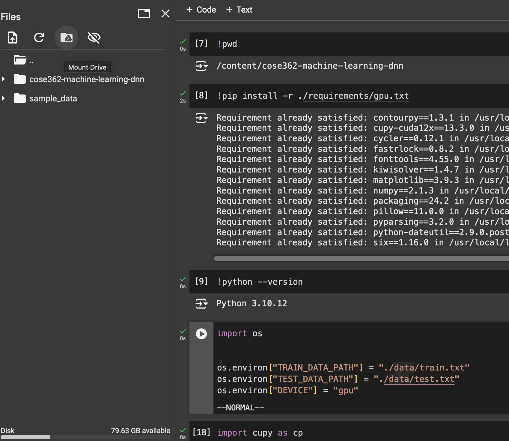
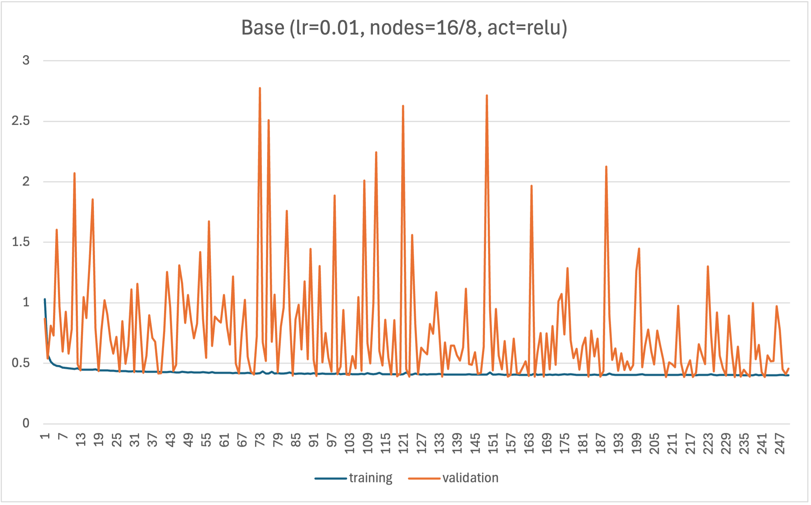
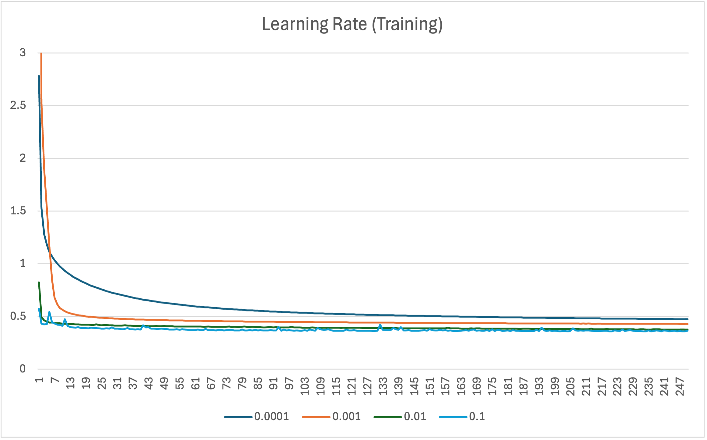
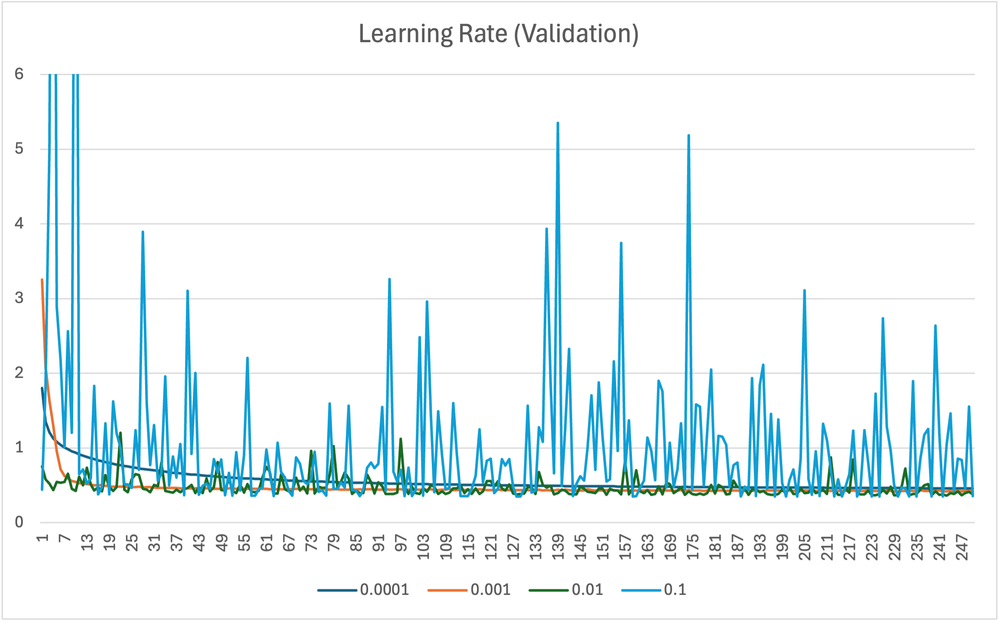
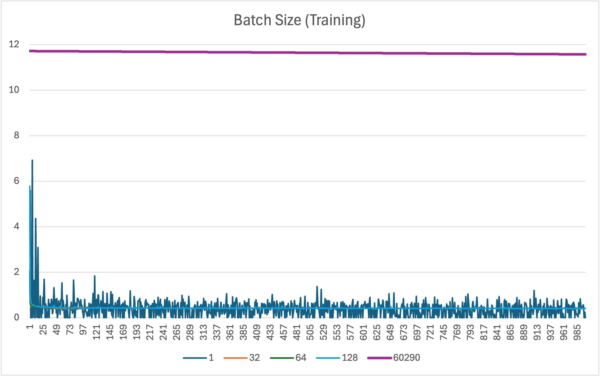
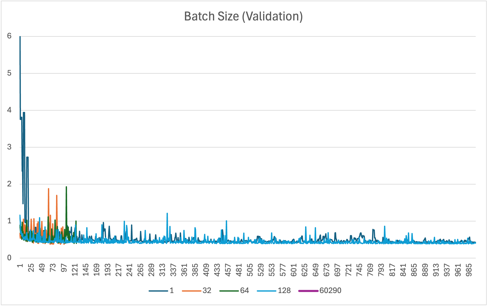
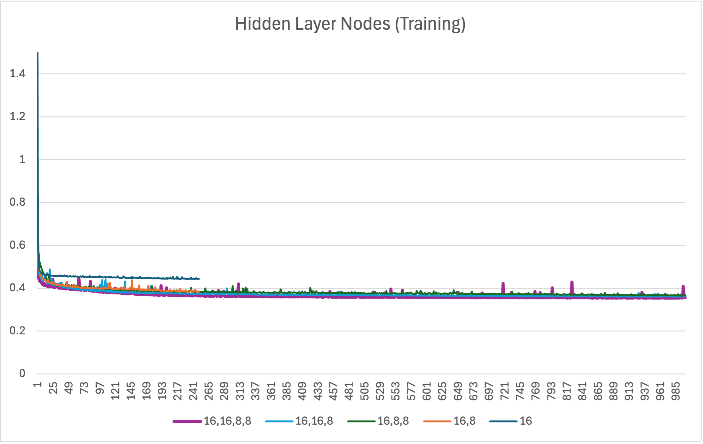
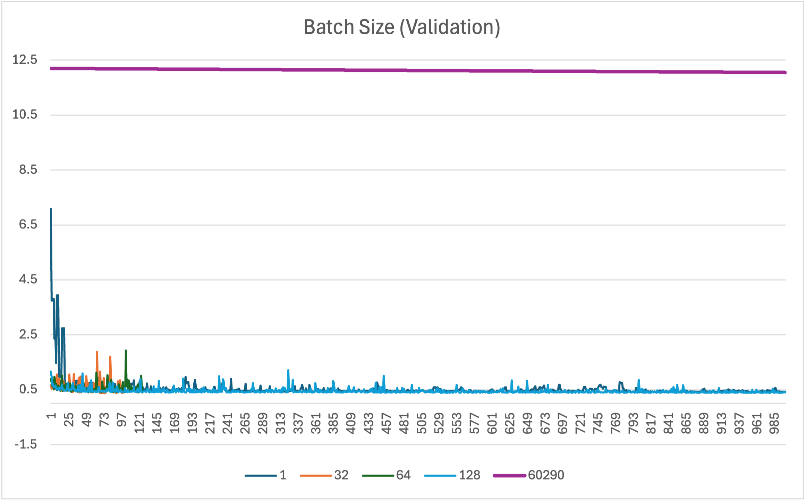
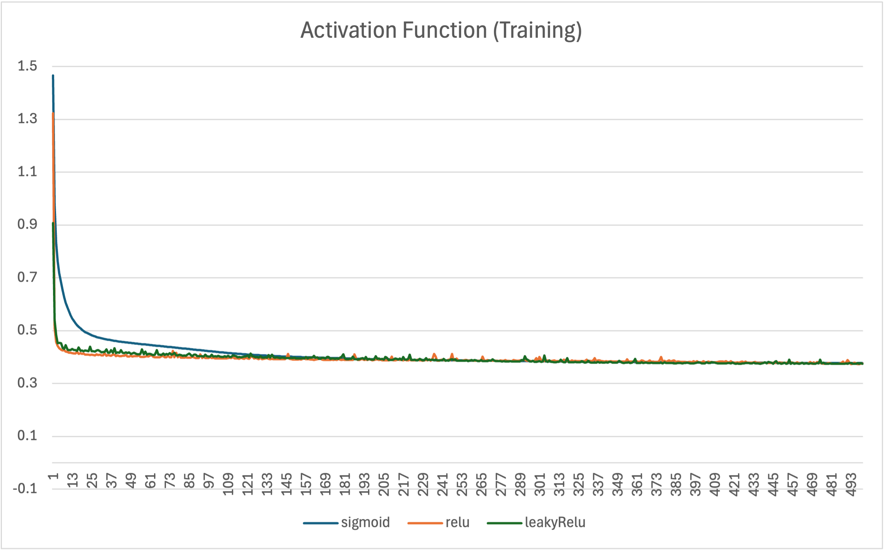

# DNN Classifier with mini-batch gradient descent

- [지시사항](#지시사항)
- [파일 구조](#파일-구조)
- [실행 방법](#실행-방법)
  - [1. 환경변수 설정](#1-환경변수-설정)
  - [리눅스/MacOS 환경](#리눅스macos-환경)
  - [Colab 환경](#colab-환경)
- [모델 개요](#모델-개요)
  - [데이터셋](#데이터셋)
  - [학습 방법](#학습-방법)
  - [검증 방법](#검증-방법)
- [모델 선택](#모델-선택)
  - [Hyperparameter](#hyperparameter)
  - [실험 방법](#실험-방법)
  - [실험 결과](#실험-결과)
- [성능 평가](#성능-평가)

## 지시사항

```markdown
Classification experiment using DNNs

- Implement a mini-batch SGD algorithm to train the parameters of a DNN.
- For the following experiments, plot the error graphs for both the training and
validation data.
  - Experiment with different learning rates
  - Experiment with various mini-batch sizes
  - Experiment with different numbers of nodes and layers (additional 10 points)
  - Experiment with various types of activation functions (additional 10 points)

This document includes the explanation of the training and validation procedures.
```

## 파일 구조

```plaintext
.
├── data                    # 데이터셋
│   ├── test.txt
│   └── train.txt
├── dnn
│   ├── __init__.py
│   ├── data_processors.py  # 데이터 전처리
│   ├── experiments.py      # 실험 관리
│   ├── layers.py           # 신경망 계층 정의
│   ├── libs.py             # 기본 라이브러리 (numpy import 등)
│   ├── losses.py           # 손실 함수 정의
│   ├── main.py             # 실험 실행 entrypoint
│   ├── metrics.py          # 성능 평가 지표 정의
│   └── models.py           # 신경망 모델 정의
├── tests                   # 테스트 코드
│   └── ...
├── docs                    # README.md에 사용된 이미지 파일, 보고서 출력 파일
│   └── ...
├── logs                    # 실험 결과 출력 파일(csv)
│   └── ...
├── requirements            # 패키지 의존성 정의
│   ├── cpu.txt
│   ├── dev.txt
│   └── gpu.txt
├── poetry.lock
├── pyproject.toml
└── README.md               # 보고서
```

## 실행 방법

### 1. 환경변수 설정

### 리눅스/MacOS 환경

파이썬 3.10 이상이 설치된 리눅스 환경을 기준으로 설명합니다.

```bash
export TEST_DATA_PATH="./data/test_data.txt"
export TRAIN_DATA_PATH="./data/train_data.txt"
export DEVICE="cpu"
```

#### 2. 파이썬 패키지 설치

Poetry 활용을 권장합니다.

```bash
poetry install  # Poetry가 설치되어 있을 경우
pip install -r requirements/base.txt  # Poetry가 없을 경우
```

#### 2.1 CUDA 환경 구성 (선택)

> 학습 속도가 느려서 추천하지 않습니다.

```bash
export DEVICE="gpu"
```

CUDA 환경에서 실행하려면 추가 패키지를 설치해야 합니다.

```bash
# CUDA 12.X (Colab 환경)
poetry install --with gpu  # Poetry가 설치되어 있을 경우
pip install -r requirements/gpu.txt  # Poetry가 없을 경우
```

CUDA 12.X 이외 버전에는 별도의 패키지를 설치해야 합니다.

> [CuPy 설치방법 참고](https://docs.cupy.dev/en/v12.3.0/install.html#installing-cupy)

```bash
pip install cupy-cudaxxx  # CUDA 버전에 따라 xxx를 적절히 변경
```

#### 3. 모델 학습 및 테스트

```bash
pwd  # /.../cose362-machine-learning-dnn 확인
poetry run python dnn/main.py  # Poetry가 설치되어 있을 경우
python dnn/main.py  # Poetry가 없을 경우
```

### Colab 환경



## 모델 개요

### 데이터셋

- input x는 D=13차원의 연속형 변수입니다.
- label r은 K=2개의 클래스를 갖는 범주형 변수입니다.
- train dataset에는 N=60290개의 sample이 존재합니다.

### 학습 방법

mini-batch SGD 알고리즘을 사용하여 DNN의 파라미터를 학습합니다.

- 학습 파라미터에는 linear layer의 weight와 bias가 있습니다.
- 학습 데이터셋을 랜덤하게 섞은 후 mini-batch size만큼 나누어 학습합니다. mini-batch 단위로 평균 loss를 계산하여 파라미터를 한 번 업데이트합니다.
- 학습 데이터셋을 한 번 모두 사용한 것을 1 epoch이라고 합니다. 한 epoch이 끝나면 학습 데이터셋을 다시 섞어 다음 epoch을 진행합니다.
- 학습 데이터셋을 여러 epoch에 걸쳐 학습합니다.

#### Loss 계산

분류 문제이므로 cross-entropy loss를 사용합니다.

mini-batch size에 무관히 loss의 scale이 변하지 않도록 mini-batch 당 loss 합을 mini-batch size로 나누어 줍니다.

```math
E(W, b | x, r) = - \frac{1}{B} \sum_{i=1}^B \sum_{k=1}^K r_{ik} \log y_{ik}
```

- k: class index
- K: class 개수
- i: sample index
- B: mini-batch size (mini-batch에 포함된 sample 수)
- r_ik: mini-batch의 i번째 sample의 true label (one-hot encoding)
- y_ik: mini-batch의 i번째 sample의 예측 label의 확률
  - 선형 계층의 출력 y_i를 softmax 함수로 변환한 벡터 softmax(y_i)의 k번째 원소

#### 최적화

mini-batch SGD를 사용하여 loss를 최소화하는 파라미터를 찾습니다.

mini-batch 내 모든 sample에 대한 loss의 gradient를 계산한 후, gradient의 평균을 구하여 파라미터를 업데이트합니다. mini-batch size에 무관히 gradient의 scale이 변하지 않게 만들어 learning rate의 효과를 일정하게 만드는 역할을 합니다. mini-batch size가 전체 데이터셋 크기의 약수가 아니라면 한 epoch의 마지막 mini-batch size는 지정한 size보다 작을 수 있습니다.

만약 mini-batch size가 1이라면 SGD, mini-batch size가 전체 데이터셋의 크기와 같다면 batch GD가 됩니다.

```math
W_{l+1} = W_l - \eta \cdot \frac{1}{B} \sum_{i=1}^B\frac{\partial E(W, b | x, r)}{\partial W}
```

```math
b_{l+1} = b_l - \eta \cdot \frac{1}{B} \sum_{i=1}^B\frac{\partial E(W, b | x, r)^\top}{\partial b}
```

- W: weight
- b: bias
- t: iteration index
- η: learning rate
- l: layer index
- i: sample index
- B: mini-batch size

### 검증 방법

검증(validation)은 hyperparameter를 선택하고 최대 epoch 수를 결정하기 위해 사용합니다.

검증 데이터셋은 test.txt로 제공됩니다.

- 특정 hyperparameter 조합에 대해 학습 데이터셋으로 모델을 학습한 후, 검증 데이터셋을 모델의 성능을 평가합니다. 검증 데이터셋에 대한 성능이 가장 좋은 hyperparameter 조합을 선택합니다.
- 매 epoch마다 전체 검증 데이터셋에 대한 loss를 계산하여 epoch별 학습 데이터셋에 대한 loss와 비교합니다. 검증 데이터셋에 대한 loss가 증가하면 overfitting이 발생했다고 판단하여 학습을 중단합니다.

## 모델 선택

### Hyperparameter

> dnn/experiments.py와 main.py에 구현되어 있습니다.

```python
@dataclass
class HyperParams:
    lr: float  # learning rate
    batch_size: int  # mini-batch size
    hidden_nodes: list[int]  # hidden layer 및 layer별 노드 수
    act_func: ActFunc  # activation function
    max_epoch: int  # 최대 epoch 수
```

### 실험 방법

- 간단한 학습을 통해 기본 조합(base_config)을 선택합니다.
- base_config을 기반으로 hyperparameter를 한 종류씩 변경하면서 실험을 진행합니다.
- max_epoch은 모델 복잡도와 학습 시간을 고려하여 유동적으로 설정했습니다.

#### Base 조합

```python
base_config = HyperParams(
    lr=0.01,
    batch_size=32,
    hidden_nodes=[64, 32],
    act_func=ActFunc.RELU,
    max_epoch=100,  # 실험 경우에 따라 변경
)
```

### 실험 결과

> 가로 축은 epoch 수, 세로 축은 batch 평균 cross-entropy loss입니다.











각 hyperparameter별 실험에서 최저 loss를 기록한 조합을 선택합니다.

#### 최종 모델

```python
selected_config = HyperParams(
    lr=0.001,
    hidden_nodes=[16, 16, 8, 8],
    batch_size=32,
    act_func=ActFunc.RELU,
    max_epoch=4000,
)
```

## 성능 평가

EM 알고리즘의 최종 모델을 train.txt의 학습 데이터셋만으로 학습시켰으므로, 공정한 비교를 위해 DNN 모델도 train.txt의 학습 데이터셋만으로 학습시킵니다.

```plaintext
==== Experiment ====
Hyperparameters
- lr: 0.001
- batch_size: 32
- hidden_nodes: [16, 16, 8, 8]
- act_func: ActFunc.RELU
- max_epoch: 4000
--------------------
[2024-12-01 23:05:15] Training started.
[2024-12-01 23:33:07] Training complete.
--------------------
[2024-12-01 23:33:07] Prediction started.
Error rate: 16.78%
[2024-12-01 23:33:07] Prediction complete.
--------------------
Total elapsed time: 0:27:52.992542
Saved to logs/lr=0.001_batch=32_nodes=16,16,8,8_act=relu_241201-233307_errorRate=0.17.csv
====================
```

test.txt의 검증 데이터셋에 대한 error rate를 측정한 결과는 16.78%입니다. EM 알고리즘의 15.18%보다 높은 error rate를 보입니다.

이는 데이터셋의 크기가 작고, DNN 모델의 복잡도가 높아서 발생한 것으로 보입니다. 또한, 모델 선택에서 모든 경우를 고려하지 않았기 때문에, 최적의 hyperparameter 조합을 찾지 못했을 가능성이 있습니다.
